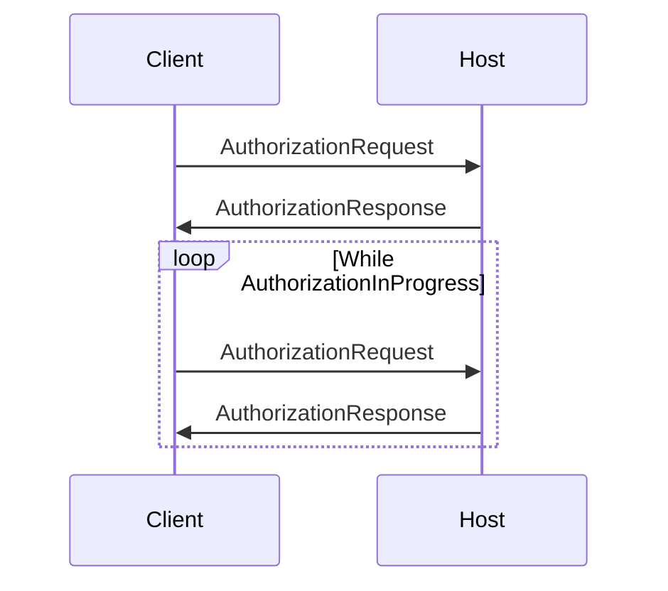
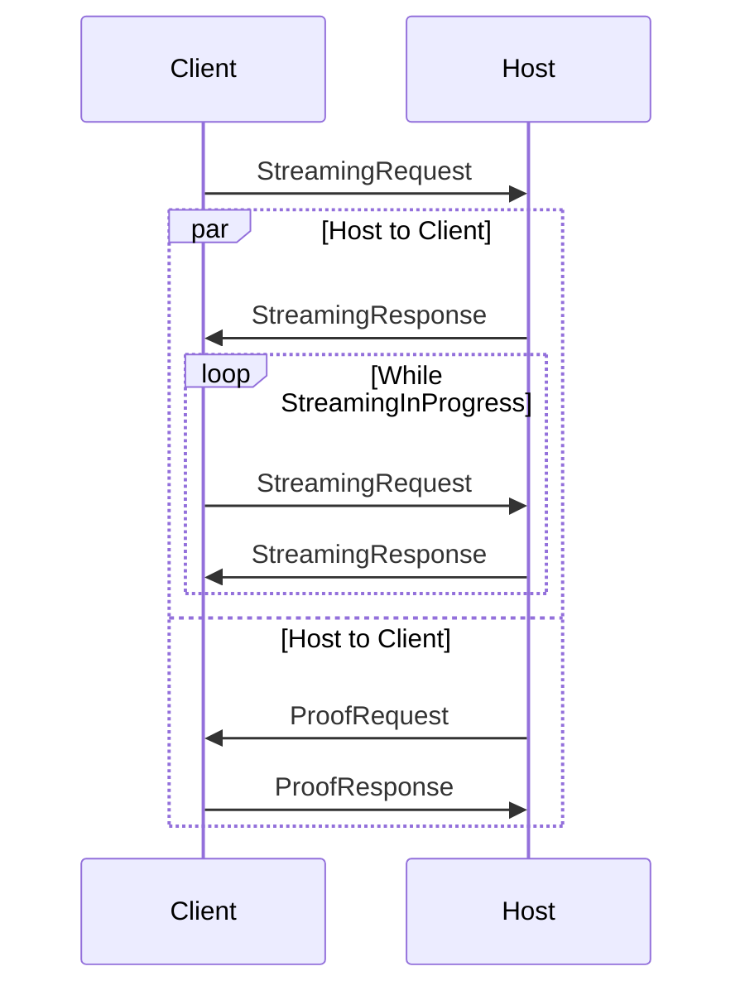
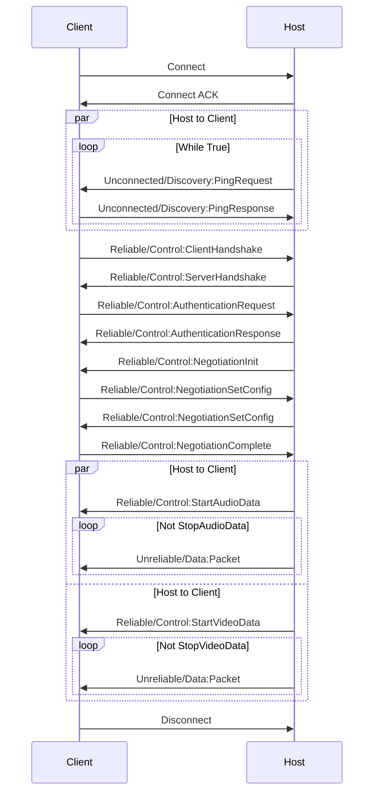

# Reference Implementation for SteamLink Protocol

## Encryption & Decryption

### Symmetric Encryption & Decryption

### Asymmetric Encryption

```
RSA-PKCS1-OAEP(plain, key, hash=SHA1)
```

## Service Discovery

## Pairing

### Sequence



### Results

## Requesting Stream

### Sequence



### Results

## Opening Stream

### Sequence



### Packet Types

#### Connect

```
has_crc = false
type = 1
payload = crc32c(b'Connect')
```

#### Connect ACK

#### Unreliable

`fragment_id` will be number of following fragments.

#### Unreliable Frag

#### Reliable

`fragment_id` will be number of following fragments. For encrypted message, decryption should be done on concatenated
message body.

#### Reliable Frag

#### ACK

ACK will be responded if the peer accepted a reliable/frag packet.

#### Negative ACK (NACK)

NACK will be sent if the peer doesn't accept a reliable/frag packet.

#### Disconnect

After client or host send this message, connection will be terminated.
