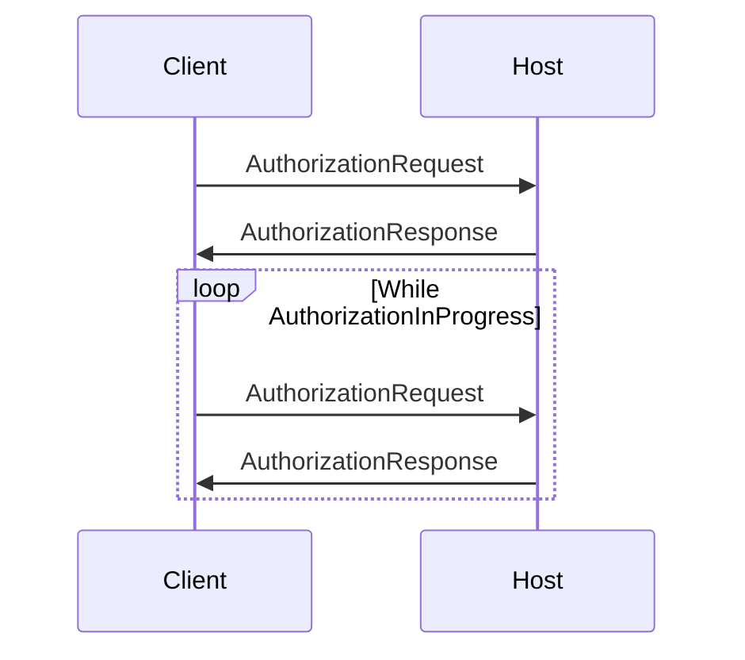

# Reference Implementation for SteamLink Protocol

## Encryption Method

## Service Discovery

## Pairing

### Sequence



### Results

## Requesting Stream

### Sequence

### Results

## Opening Stream

### Packet Type: Connect

```
has_crc = false
type = 1
payload = crc32c(b'Connect')
```

(not started yet...)