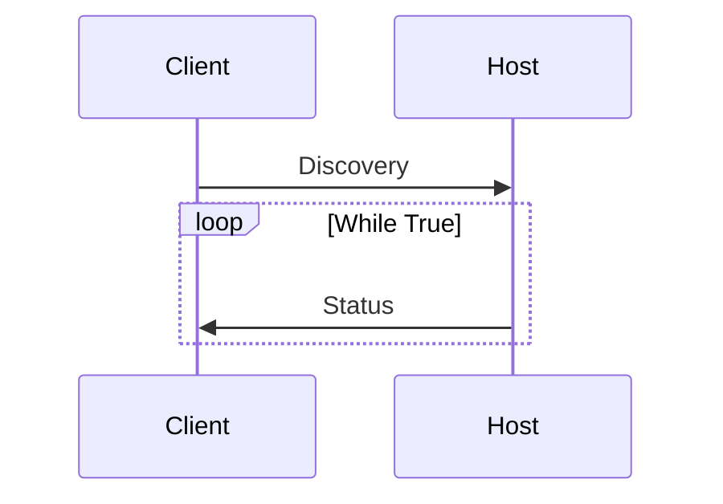
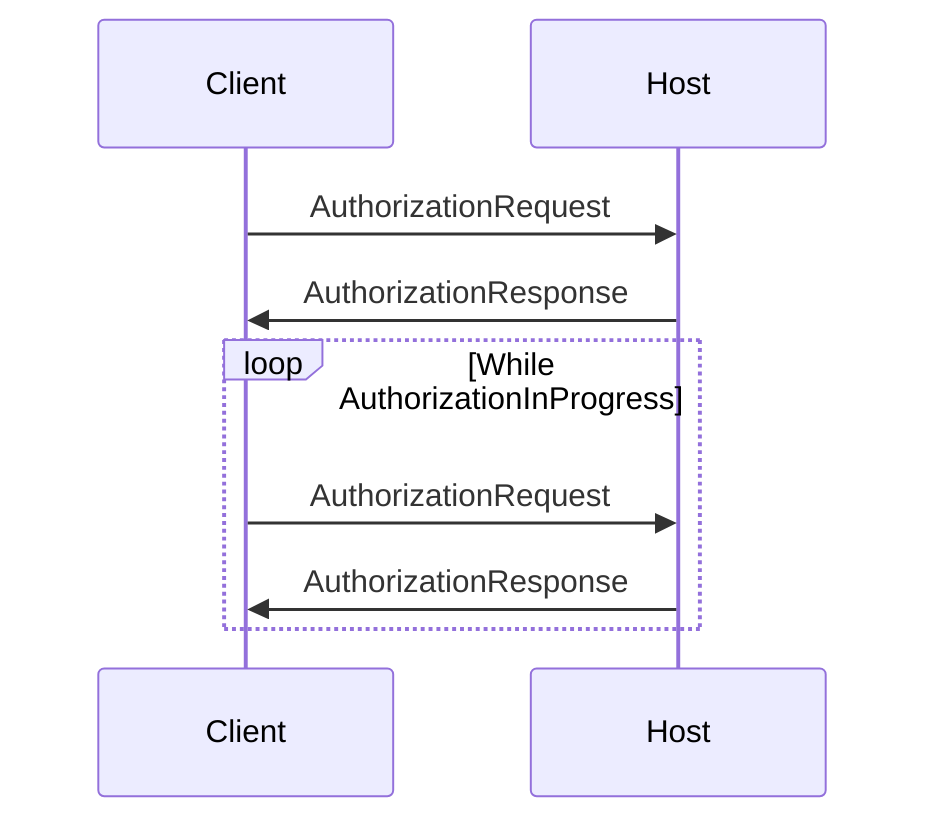
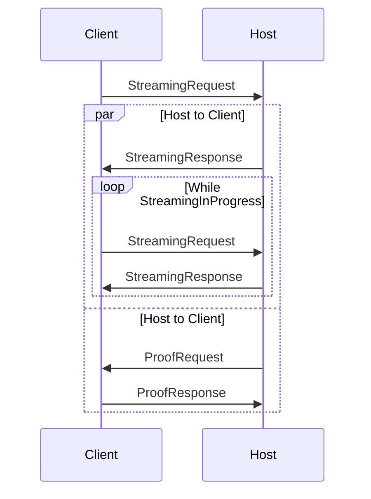

## Service Discovery

## Scanning

### Sequence

```mermaid
sequenceDiagram
  Client ->> Host: Discovery
  loop While True
    Host ->> Client: Status
  end
```

## Pairing

### Sequence

```mermaid
sequenceDiagram
  Client ->> Host: AuthorizationRequest
  Host ->> Client: AuthorizationResponse
  loop While AuthorizationInProgress
    Client ->> Host: AuthorizationRequest
    Host ->> Client: AuthorizationResponse
  end
```

### Results

## Requesting Stream

### Sequence

```mermaid
sequenceDiagram
  Client ->> Host: StreamingRequest
  par Host to Client
    Host ->> Client: StreamingResponse
    loop While StreamingInProgress
      Client ->> Host: StreamingRequest
      Host ->> Client: StreamingResponse
    end
  and Host to Client
    Host ->> Client: ProofRequest
    Client ->> Host: ProofResponse
  end
```

### Results