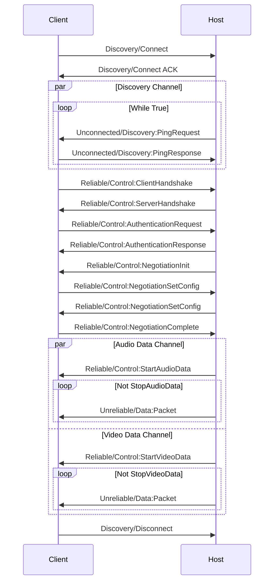

## Sequence



## Packet Types

### Unconnected (0)

### Connect (1)

```
has_crc = false
type = 1
payload = crc32c(b'Connect')
```

### Connect ACK (2)

### Unreliable (3)

`fragment_id` will be number of following fragments.

### Unreliable Frag (4)

### Reliable (5)

`fragment_id` will be number of following fragments. For encrypted message, decryption should be done on concatenated
message body.

### Reliable Frag (6)

### ACK (7)

ACK will be responded if the peer accepted a reliable/frag packet.

### Negative ACK, NACK (8)

NACK will be sent if the peer doesn't accept a reliable/frag packet.

### Disconnect (9)

After client or host send this message, connection will be terminated.

## Channels

### Discovery (0)

Discovery channel is for sending ping request/response.

#### Message Types

### Control (1)

Control channel is for sending handshake, performing authorization, sending controls and transferring input events.

#### Message Types

### Stats (2)

#### Message Types

### Data (3+)

Channels above 3 will be opened by message `k_EStreamControlStart***Data`. It will be closed by
message `k_EStreamControlStop***Data`.

#### Message Types
